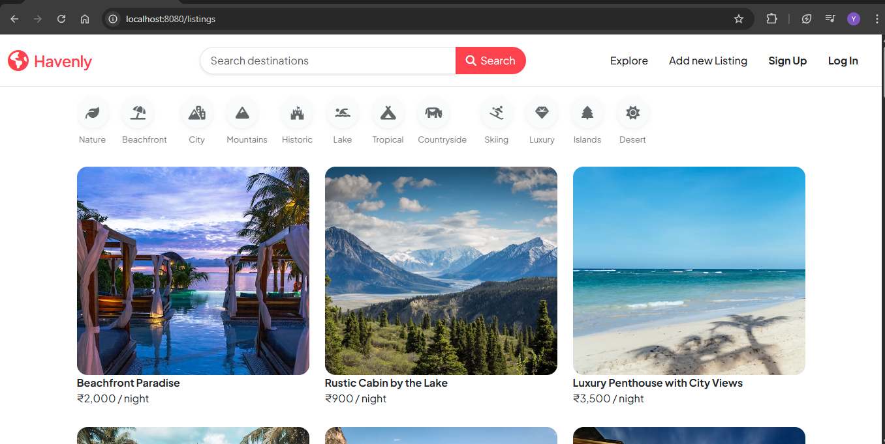
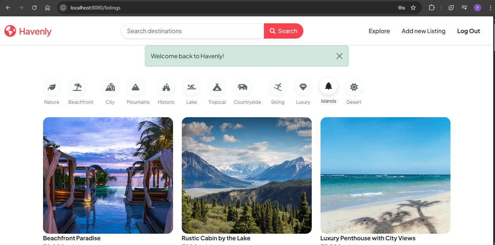
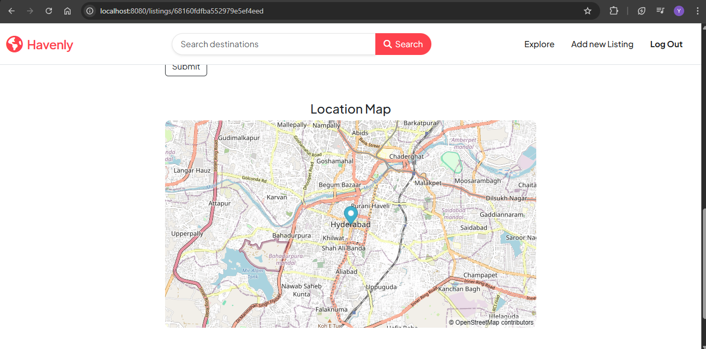
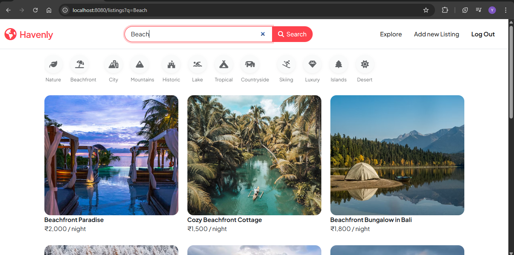
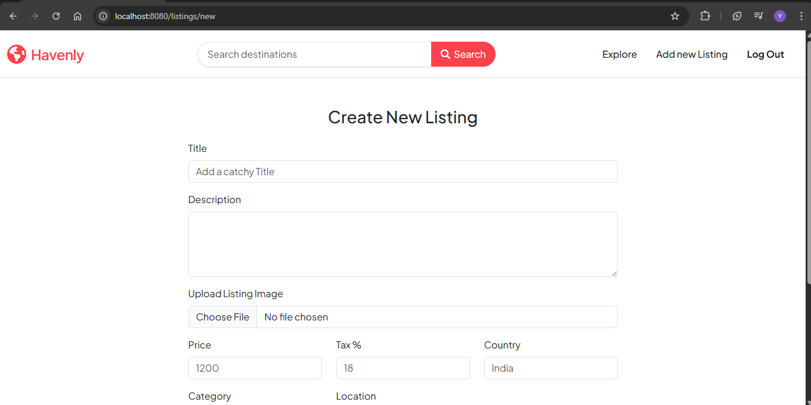
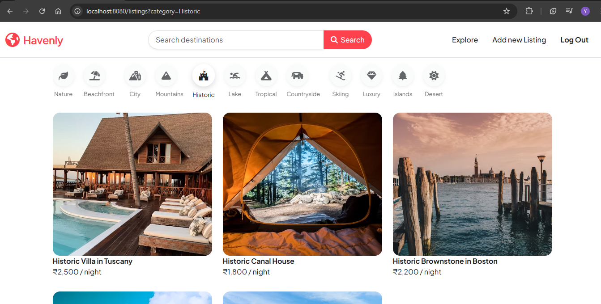

# 🏡 Havenly – Seamless Vacation & Stay Rentals

**Havenly** is a modern, full-stack web platform that connects travelers with unique places to stay. Designed with user experience, security, and reliability in mind, it allows hosts to list properties and guests to find their perfect getaway, all in one place.

---

## 🎬 Demo

🔗 [Click here to watch the full demo](https://drive.google.com/file/d/1P9lDrkK47Mefkhm01gyUL6zQCR1IPk_N/view?usp=sharing)

---

## Key Highlights

-  **Interactive Map Search:** Browse listings visually using a dynamic map interface.
-  **5-Star Review System:** Guests can leave ratings and feedback on properties.
-  **User-Centered Listings:** Hosts can post, manage, and remove listings with full ownership control.
-  **Secure Access:** Login and signup with encrypted password storage and protected routes.
-  **Verified Ownership:** Only property owners can edit or delete their listings.
-  **Mobile-Friendly:** Responsive layout ensures seamless usage across all devices.

---

## 🧰 Tech Stack

### Frontend
- **React.js** – Component-based UI
- **Tailwind CSS** – Modern, utility-first styling
- **Axios** – API requests
- **Map API** – Interactive geographic map integration

### Backend
- **Node.js** – JavaScript runtime
- **Express.js** – Web framework
- **MongoDB + Mongoose** – NoSQL database with elegant schemas
- **JWT + Bcrypt** – Secure authentication and password hashing

---

## 🖼 Screenshots

## 🖼 Screenshots

### 🏠 Homepage

---

### 🔐 Login Page

---

### 📍 Map Integration

---

### 🔎 Search Bar with Filters

---

### ➕ New Listing Creation

---

### 🧭 Navigation Options

## 🙋‍♀️ About Me

👋 Hi! I’m [Yamini Thirumani](https://github.com/yamini-thirumani) ,  a passionate developer focused on building intuitive, secure, and performance-driven web applications.  
This project is part of my journey to create impactful solutions through technology.

---

## 🤝 Feedback & Contributions

Found a bug or have suggestions?  
Feel free to open an issue or fork this repo and contribute!

---

> Made with 💖 and clean code.
